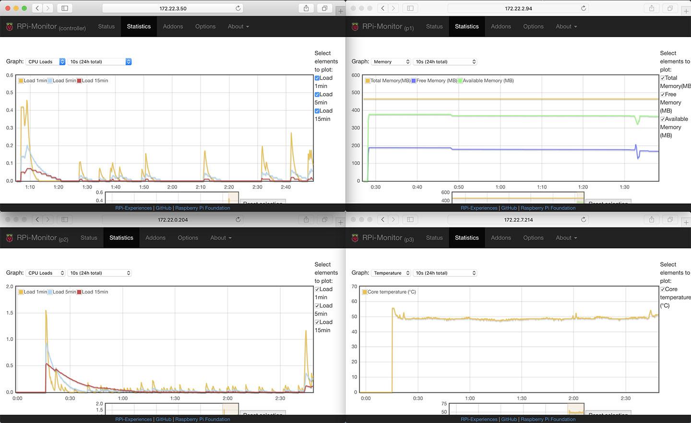

# Prowler
Raspberry Pi Cluster Network Vulnerability Scanner, developed during Singapore Infosec Community Hackathon - HackSmith v1.0

### Capabilities

-   Scan a network (or a particular subnet) for all IP addresses associated with active devices
-   Determine if there are any open ports on the device
-   Associate the ports with common services
-   Test devices against a dictionary of factory default and common credentials
-   Notify users of security lapses through an online dashboard

### Demos
- [Cluster Scan Demonstration Jupyter Notebook](http://nbviewer.jupyter.org/github/tlkh/prowler/blob/master/ClusterDemo.ipynb)
- [Single Scan Demonstration Jupyter Notebook](http://nbviewer.jupyter.org/github/tlkh/prowler/blob/master/SingleDemo.ipynb)
- Try out the web dashboard [here](https://tlkh.github.io/prowler/app/)

### Hardware
-   Raspberry Pi [Cluster HAT](https://clusterhat.com/) (with 4 \* Pi Zero W)
-   Raspberry Pi 3
-   No external router needed!

### Software Stack

-   Raspbian Stretch (Controller Pi)
-   Raspbian Stretch Lite (Worker Pi Zero)
-   Note: For ease of setup, use the images provided by Cluster Hat! [Instructions](https://clusterhat.com/setup-software)
-   Python 3
-   Firebase Real-time Database (to forward the information to the web dashboard)
-   Bonus tool: [pssh](https://www.tecmint.com/execute-commands-on-multiple-linux-servers-using-pssh/) for executing SSH commands on all 4 pi zeros simultaneously.

## Deploying Prowler

1. Clone the git repository: `git clone https://github.com/tlkh/prowler.git`
2. Install dependencies by running `sudo pip3 install python-libnmap dispy paramiko pyrebase` on the controller Pi
3. From the controller Pi, SSH into each of the worker Pi using `ssh pi@p1.local` ... `ssh pi@p4.local` and run the same command on each: `sudo pip3 install python-libnmap dispy paramiko pyrebase`
4. Install `telepot` on the controller Pi by running `sudo pip3 install telepot` if you want to try running the Telegram bot.

* `dispy` ([website](http://dispy.sourceforge.net/)) is the star of the show. It allows allows us to create a job queue that will be processed by the worker Pi Zeros.
* `python-libnmap` is the python wrapper around [nmap](https://nmap.org/), an open source network scanner. It allows us to scan for open ports on devices.
* `paramiko` is a python wrapper around SSH. We use it to probe SSH (port 22) on devices to test for common credentials.
* `pyrebase` is needed to upload our results to a Firebase Real-time Database

1. Run `clusterhat on` on the controller Pi to ensure that all Pi Zeros are powered up.
2. Use pssh to run the command `/home/pi/dispy/py3/dispy/dispynode.py --clean --daemon&` on the four Pi Zeros
3. Run `python3 compute.py` on the controller Pi to start Prowler

To edit the range of IP addresses being scanned, edit the following lines in `compute.py`:
```
test_range = []

    for i in range(0, 1):
    
        for j in range(100, 200):
        
            test_range.append("172.22." + str(i) + "." + str(j))
```

## Useful Snippets
-   To run ssh command on multiple devices `pssh -h pssh-hosts -l username -A -i
    "command"`
-   To create the cluster (in `compute.py`): `cluster =
    dispy.JobCluster(compute, nodes='pi0_ip', ip_addr='pi3_ip')`
-   Check connectivity: `ping p1.local -c 1 && ping p2.local -c 1 && ping
    p3.local -c 1 && ping p4.local -c 1`
-   Temperature Check: `/opt/vc/bin/vcgencmd measure_temp && pssh -h workers -l
    pi -A -i "/opt/vc/bin/vcgencmd measure_temp" | grep temp`
-   rpimonitor ([how to install](http://rpi-experiences.blogspot.sg/p/rpi-monitor-installation.html)):



#### Contributors:

- Faith See
- Wong Chi Seng
- Timothy Liu

[](https://opensource.org/licenses/MIT)