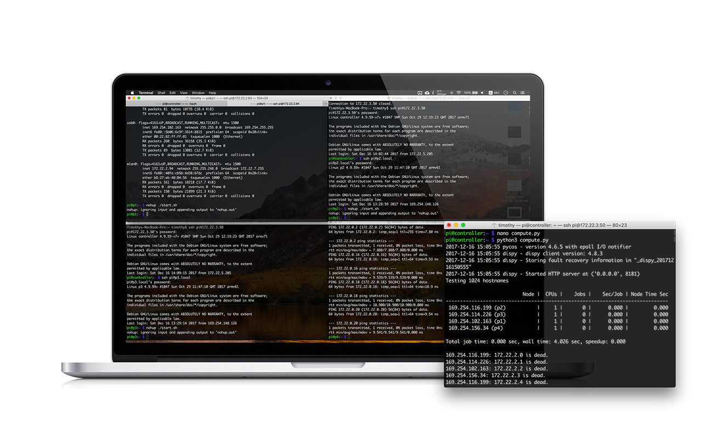
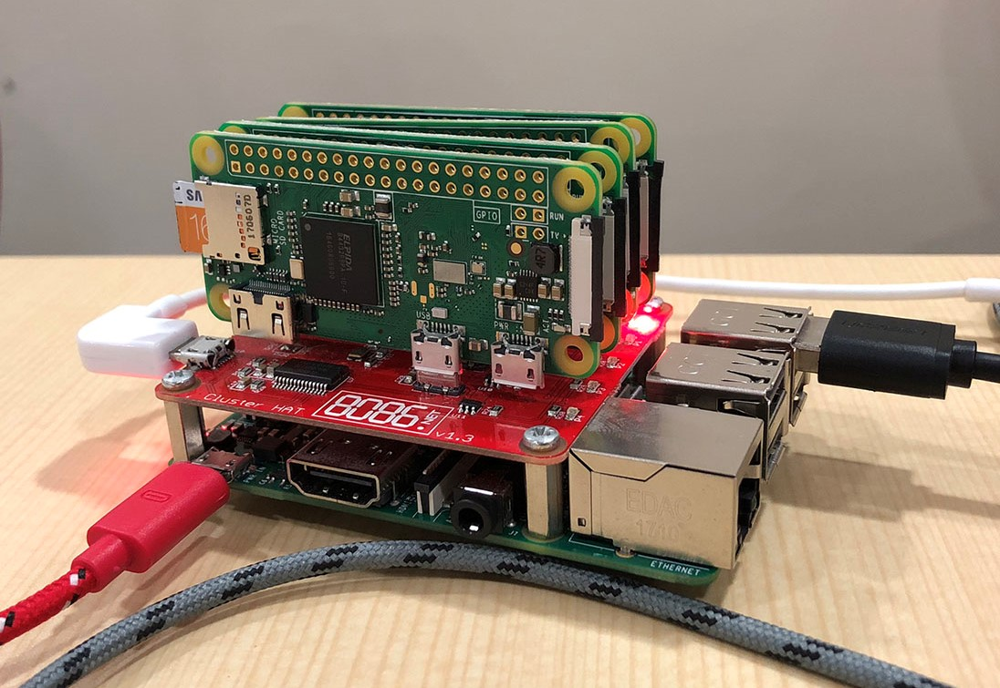
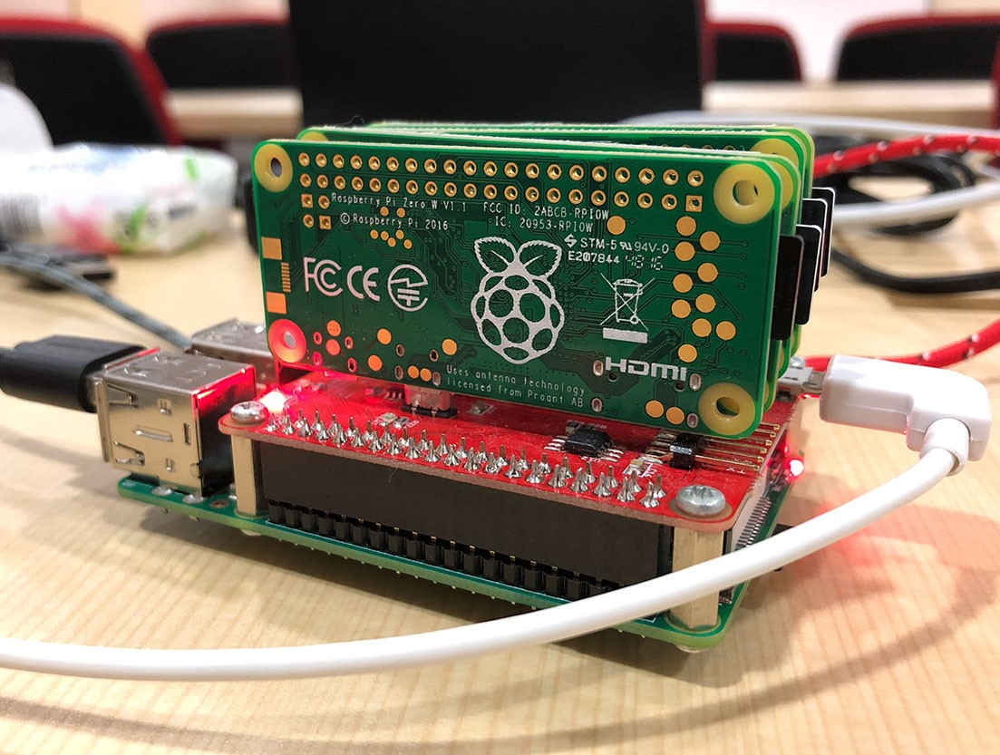

# Prowler
#### Raspberry Pi Cluster Network Vulnerability Scanner

Why did we build Prowler?
-------------------------

In view of the Mirai botnet case which exploited under-secured IoT devices that
could be remotely accessed via easily guessable factory default or popular login
credentials, our team wanted to propose a solution to inform users of their
lackluster security practices in order to promote basic security practices.

## What did we build Prowler to do?
-   Scan a network for all IP addresses that are up and extract these IP
    addresses
-   Scan the ports of extracted IP addresses
-   Access our compiled standard dictionary of default / popular / common
    usernames and passwords to check for devices that have such credentials
-   Notify users that such credentials ought to be rectified through an online
    console

 

## How did we build Prowler?
### Hardware
-   Raspberry Pi [Cluster HAT](https://clusterhat.com/) (4 \* Pi Zero W)
-   Raspberry Pi 3
-   No external router needed!

### Files
-   `compute.py` is the main file

### Software
-   Python 3.6
-   Dispy
-   [pssh](https://www.tecmint.com/execute-commands-on-multiple-linux-servers-using-pssh/)
-   Firebase

## What else could Prowler potentially do?
-   Utilize the Microsoft Bot Framework to provide users with the real-time
    information from Firebase through channels such as Telegram and Slack

## Important Snippets
-   To run ssh command on multiple devices `pssh -h pssh-hosts -l username -A -i
    "command"`
-   To create the cluster (in octopi/`compute.py`): `cluster =
    dispy.JobCluster(compute, nodes='pi0_ip', ip_addr='pi3_ip')`
-   Check connectivity: `ping p1.local -c 1 && ping p2.local -c 1 && ping
    p3.local -c 1 && ping p4.local -c 1`
-   Temperature Check: `/opt/vc/bin/vcgencmd measure_temp && pssh -h workers -l
    pi -A -i "/opt/vc/bin/vcgencmd measure_temp" | grep temp`

#### External Links
-   https://nmap.org/
-   https://pypi.python.org/pypi/python-nmap
-   https://docs.python.org/3.6/library/subprocess.html\#module-subprocess
-   http://qdosmsq.dunbar-it.co.uk/blog/2013/03/linux-command-to-retrieve-hardware-serial-numbers-etc/
-   http://resources.infosecinstitute.com/popular-tools-for-brute-force-attacks/
-   https://github.com/jeanphorn/wordlist
-   https://sonar.labs.rapid7.com/

#### Contributors:

- Faith See
- Wong Chi Seng
- Timothy Liu