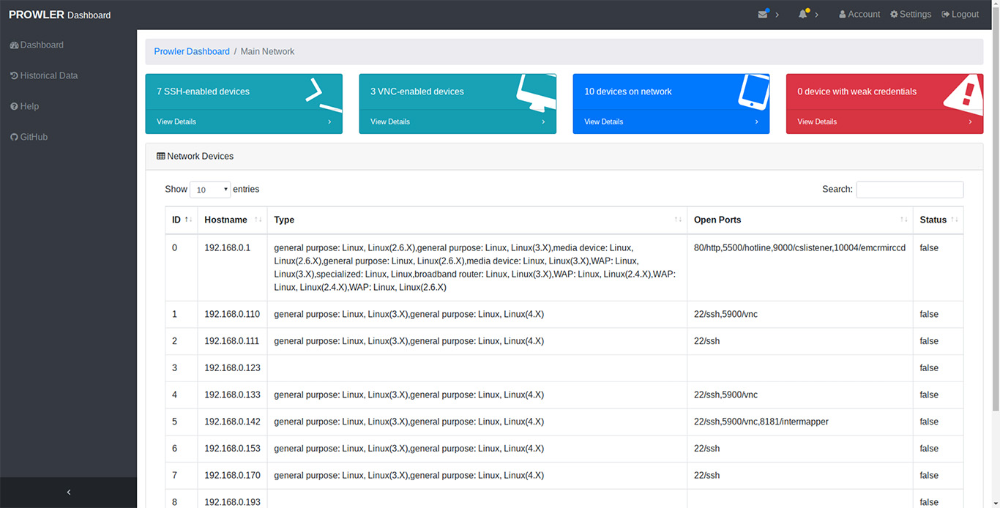
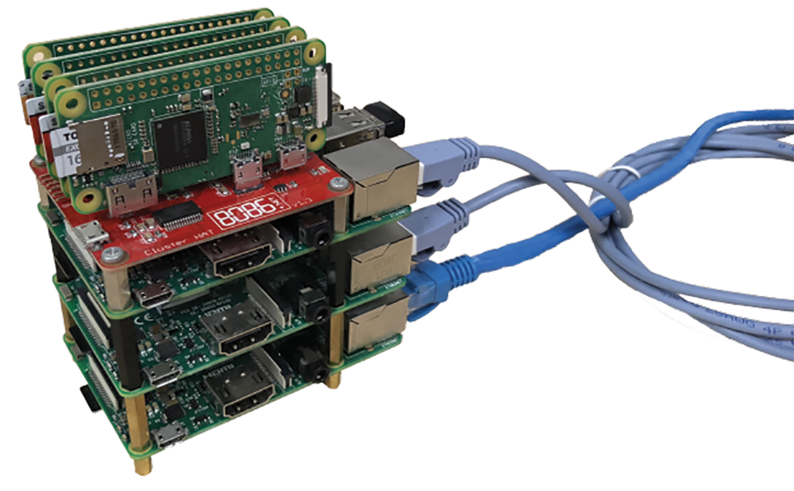

# Prowler
**Prowler** is a Network Vulnerability Scanner implemented on a Raspberry Pi Cluster, first developed during Singapore Infosec Community Hackathon - HackSmith v1.0.[](https://opensource.org/licenses/MIT)
[](https://www.blackhat.com/asia-18/arsenal/schedule/#prowler---cluster-network-scanner-9901)



### Capabilities

-   Scan a network (a particular subnet or a list of IP addresses) for all IP addresses associated with active network devices
-   Determine the type of devicing using fingerprinting
-   Determine if there are any open ports on the device
-   Associate the ports with common services
-   Test devices against a dictionary of factory default and common credentials
-   Notify users of security vulnerabilities through an online dashboard

### Planned Capabilities

- Greater variety of vulnerability assessment capabilities (webapp etc.)

### Hardware
-   Raspberry Pi [Cluster HAT](https://clusterhat.com/) (with 4 \* Pi Zero W)
-   Raspberry Pi 3
-   Networking device



### Software Stack

-   Raspbian Stretch (Controller Pi)
-   Raspbian Stretch Lite (Worker Pi Zero)
-   Note: For ease of setup, use the images provided by Cluster Hat! [Instructions](https://clusterhat.com/setup-software)
-   Python 3 (not tested on Python 2)
-   Python packages see `requirements.txt`
-   Ansible for managing the cluster as a whole (`/playbooks`)

Key Python Packages:

- `dispy` ([website](http://dispy.sourceforge.net/)) is the star of the show. It allows allows us to create a job queue that will be processed by the worker nodes.
- `python-libnmap` is the python wrapper around [nmap](https://nmap.org/), an open source network scanner. It allows us to scan for open ports on devices.
- `paramiko` is a python wrapper around SSH. We use it to probe SSH on devices to test for common credentials.
- `eel` is used for the web dashboard (seperate repository, [here](https://github.com/tlkh/prowler-dashboard))

### Ansible Playbooks

For the playbooks to work, `ansible` must be installed (`sudo pip3 install ansible`). Configure the IP addresses of the nodes at `/etc/ansible/hosts`.
**WARNING: Your mileage may vary as these were only tested on my setup**

- `shutdown.yml` and `reboot.yml` self-explanatory
- `clone_repos.yml` clone prowler and dispy repositories (required!) on the worker nodes
- `setup_node.yml` installs all required packages on the worker nodes. Does not clone the repositories!


## Deploying Prowler

1. Clone the git repository: `git clone https://github.com/tlkh/prowler.git`
2. Install dependencies by running `sudo pip3 install -r requirements.txt` on the controller Pi
3. Run `ansible-playbook playbooks/setup_node.yml` to install the required packages on worker nodes.
4. Clone the prowler and dispy repositories to the worker nodes using `ansible-playbook playbooks/clone_repos.yml`


1. Run `clusterhat on` on the controller Pi to ensure that all Pi Zeros are powered up.
2. Run `python3 cluster.py` on the controller Pi to start Prowler

To edit the range of IP addresses being scanned, edit the following lines in `compute.py`:
```
test_range = []

    for i in range(0, 1):
    
        for j in range(100, 200):
        
            test_range.append("172.22." + str(i) + "." + str(j))
```

### Old Demos
- [Cluster Scan Demonstration Jupyter Notebook](http://nbviewer.jupyter.org/github/tlkh/prowler/blob/master/ClusterDemo.ipynb)
- [Single Scan Demonstration Jupyter Notebook](http://nbviewer.jupyter.org/github/tlkh/prowler/blob/master/SingleDemo.ipynb)
- Try out the web dashboard [here](https://tlkh.github.io/prowler/app/)

## Useful Snippets
-   To run ssh command on multiple devices, install `pssh` and `pssh -h pssh-hosts -l username -A -i
    "command"`
-   To create the cluster (in `compute.py`): `cluster =
    dispy.JobCluster(compute, nodes='pi0_ip', ip_addr='pi3_ip')`
-   Check connectivity: `ansible all -m ping` or `ping p1.local -c 1 && ping p2.local -c 1 && ping p3.local -c 1 && ping p4.local -c 1`
-   Temperature Check: `/opt/vc/bin/vcgencmd measure_temp && pssh -h workers -l
    pi -A -i "/opt/vc/bin/vcgencmd measure_temp" | grep temp`
-   rpimonitor ([how to install](http://rpi-experiences.blogspot.sg/p/rpi-monitor-installation.html)):


#### Contributors:

- Faith See
- Wong Chi Seng
- Timothy Liu

**ABSOLUTELY NO WARRANTY WHATSOEVER!**